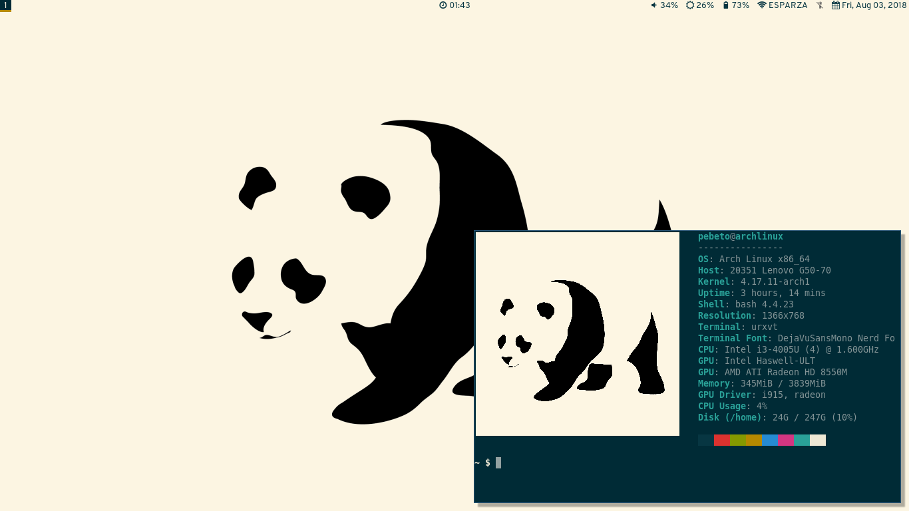

# Solarized Panda
This is the repo of my Linux rice; a minimal friendly desktop to the user sight. It uses the [Ethan Schoonover's Solarized Colour Scheme](http://ethanschoonover.com/solarized) enterely.

## Programs whose dotfiles/installation files can be found here

+ [i3wm](https://i3wm.org/)
+ [vim](https://www.vim.org/)
+ [bash](https://www.gnu.org/software/bash/)
+ [dunst](https://github.com/dunst-project/dunst)
+ [neofetch](https://github.com/dylanaraps/neofetch)
+ [polybar](https://github.com/jaagr/polybar)
+ [rofi](https://github.com/DaveDavenport/rofi)
+ [compton](https://github.com/chjj/compton)

## Dependencies

* [nerd-fonts](https://github.com/ryanoasis/nerd-fonts)
