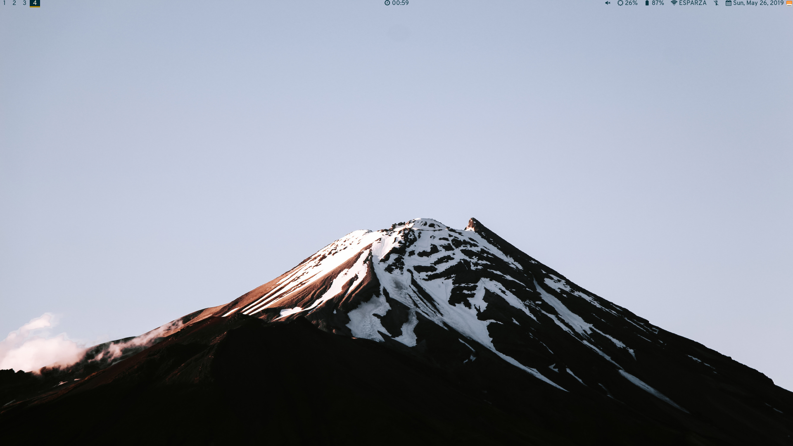

# mountainRice
### The perfect developer working environment

> In the beautiful, man sets himself up as the standard of perfection; in select cases he worships himself in it. 
> Man believes that the world itself is filled with beauty -he forgets that it is he who has created it. 
> He alone has bestowed beauty upon the world -alas! only a very human, an all too human, beauty.
>
> Nietzche, F.

**mountainRice** is a working environment focused on simplicity, usability and customization.

---

#### Dependencies
- **acpilight** https://gitlab.com/wavexx/acpilight
- **bspwm** https://github.com/Airblader/i3
- **dunst** https://github.com/dunst-project/dunst
- **feh** https://github.com/derf/feh
- **kitty** https://github.com/kovidgoyal/kitty
- **maim** https://github.com/naelstrof/maim
- **nerd-fonts** https://github.com/ryanoasis/nerd-fonts
- **picom** https://github.com/yshui/picom
- **polybar** https://github.com/jaagr/polybar
- **pulseaudio** https://gitlab.freedesktop.org/pulseaudio/pulseaudio
- **rofi** https://github.com/davatorium/rofi
- **sxhkd** https://github.com/baskerville/sxhkd
- **udiskie** https://github.com/coldfix/udiskie

---

**Wallpaper by:** [Tyler Lastovich](https://www.instagram.com/tylerlastovich/)\
